# SPARC40: AI-Powered Development Methodology Framework

> **Transform your development process with 40+ specialized AI modes, comprehensive knowledge management, and systematic quality gates.**


SPARC40 is a revolutionary development framework that implements the SPARC methodology (Specification, Pseudocode, Architecture, Refinement, Completion) with 40+ specialized AI agents, persistent knowledge management, and built-in security controls. Whether you're building a simple application or a complex enterprise system, SPARC40 provides the structure, tools, and guidance for consistent, high-quality outcomes.

## 🚀 Quick Start

```bash
# Clone SPARC40
git clone https://github.com/your-org/sparc40.git
cd sparc40

# Initialize your first project
./init-sparc-project.sh --name "My Amazing Project"

# Start developing with SPARC methodology
# Activate SPARC Specification Writer mode to begin
```

## 📋 Table of Contents

- [Key Features](#-key-features)
- [SPARC Methodology Overview](#-sparc-methodology-overview)
- [AI Mode Ecosystem](#-ai-mode-ecosystem)
- [Memory Bank System](#-memory-bank-system)
- [Architecture](#-architecture)
- [Installation](#-installation)
- [Usage Guide](#-usage-guide)
- [Configuration](#-configuration)
- [Security](#-security)
- [Advanced Features](#-advanced-features)
- [Contributing](#-contributing)
- [Support](#-support)

## ✨ Key Features

- **🤖 40+ Specialized AI Modes** - Expert AI agents for every aspect of development
- **🧠 Memory Bank System** - Persistent knowledge management across all phases
- **🛡️ Quality Gates** - Built-in validation at each development phase  
- **🔒 Security-First Design** - Comprehensive access controls and security patterns
- **⚡ Autonomous Development** - AI modes can work independently with proper context
- **📝 Complete Templates** - Ready-to-use templates for all development artifacts
- **📊 Decision Tracking** - Full rationale for all architectural and strategic decisions
- **🚀 One-Command Setup** - Automated project initialization with best practices

## 🔄 SPARC Methodology Overview

The SPARC methodology provides a systematic 5-phase approach to software development:

```mermaid
flowchart LR
    A[📋 Specification] --> B[🧮 Pseudocode]
    B --> C[🏗️ Architecture]
    C --> D[⚡ Refinement]
    D --> E[✅ Completion]
    
    A1[Requirements & Scope] -.-> A
    B1[Algorithms & Logic] -.-> B
    C1[System Design] -.-> C
    D1[Implementation & Testing] -.-> D
    E1[Integration & Delivery] -.-> E
    
    style A fill:#e1f5fe
    style B fill:#f3e5f5
    style C fill:#e8f5e8
    style D fill:#fff3e0
    style E fill:#fce4ec
```



### Phase Breakdown

| Phase | Purpose | Key Deliverables | AI Modes |
|-------|---------|------------------|----------|
| **Specification** | Define requirements and scope | `specification.md`, user personas, acceptance criteria | SPARC Specification Writer, Domain Intelligence |
| **Pseudocode** | Design algorithms and logic | `pseudocode.md`, function specs, data structures | SPARC Pseudocode Designer |
| **Architecture** | System design and tech selection | `architecture.md`, security framework, tech stack | SPARC Architect, Security Architect |
| **Refinement** | Implementation and testing | Source code, tests, performance optimization | Code Implementer, TDD Engineer |
| **Completion** | Integration and delivery | Production deployment, documentation | Integrator, DevOps Engineer |

## 🤖 AI Mode Ecosystem

SPARC40 includes 40+ specialized AI modes organized into functional categories:


### Mode Interaction Flow


## 🧠 Memory Bank System

The Memory Bank is SPARC40's knowledge management core, preserving context and decisions across all development phases:


### Memory Bank Usage

<details>
<summary>Click to expand Memory Bank file descriptions</summary>

- **`activeContext.md`** - Current working state and mode handoffs
- **`decisionLog.md`** - All architectural decisions with full rationale
- **`productContext.md`** - Business and domain knowledge foundation
- **`progress.md`** - Status tracking and milestone management
- **`systemPatterns.md`** - Reusable technical solutions and patterns

</details>

## 🏗️ Architecture

### System Architecture Overview


### Project Structure

```
sparc40/
├── 📁 memory-bank/              # Core knowledge management
│   ├── activeContext.md         # Current working context
│   ├── decisionLog.md          # Architectural decisions
│   ├── productContext.md       # Business knowledge
│   ├── progress.md             # Status tracking
│   └── systemPatterns.md       # Technical patterns
├── 📁 project/{project-id}/     # Project-specific workspace
│   ├── control/                # Orchestration controls
│   ├── sections/               # Research sections
│   ├── evidence/               # Supporting evidence
│   └── synthesis/              # Final synthesis
├── 📁 docs/                    # Documentation structure
├── 📁 reports/                 # Analysis reports
├── 📁 infrastructure/          # Infrastructure templates
├── 📁 security/                # Security frameworks
├── 📄 .roomodes                # AI mode definitions
├── 📄 .rooignore               # Security access controls
├── 📁 .roo/                    # Configuration directory
├── 📄 specification.md         # Requirements template
├── 📄 architecture.md          # Architecture template
├── 📄 pseudocode.md           # Algorithm template
└── 📄 init-sparc-project.sh   # Project initialization
```

## 📦 Installation

### Prerequisites

- **Roo Code** - VSCode extension for AI mode integration
- **Node.js 16+** - For MCP servers and tooling
- **Git** - Version control system
- **4GB RAM** minimum (8GB recommended)

### Step-by-Step Installation

1. **Install Roo Code Extension**
   ```bash
   code --install-extension roo-code
   ```

2. **Clone SPARC40 Repository**
   ```bash
   git clone https://github.com/your-org/sparc40.git
   cd sparc40
   ```

3. **Set Up Environment Variables**
   ```bash
   cp .env.example .env
   # Edit .env with your configuration
   ```

4. **Verify Installation**
   ```bash
   ./init-sparc-project.sh --help
   ```

## 📖 Usage Guide

### Starting a New Project

1. **Initialize Project Structure**
   ```bash
   ./init-sparc-project.sh --name "E-commerce Platform" --id "ecommerce-api"
   ```

2. **Begin SPARC Methodology**
   ```bash
   # Activate SPARC Specification Writer mode
   @sparc-specification-writer
   
   # The mode will guide you through:
   # - Stakeholder identification
   # - Requirements gathering
   # - Acceptance criteria definition
   ```

3. **Follow SPARC Phases**
   ```bash
   # Phase 1: Specification
   @sparc-specification-writer
   @sparc-domain-intelligence
   
   # Phase 2: Pseudocode
   @sparc-pseudocode-designer
   
   # Phase 3: Architecture
   @sparc-architect
   @sparc-security-architect
   
   # Phase 4: Refinement
   @sparc-code-implementer
   @sparc-tdd-engineer
   
   # Phase 5: Completion
   @sparc-integrator
   @sparc-devops-engineer
   ```

### Memory Bank Workflow


## ⚙️ Configuration

### AI Mode Configuration (.roomodes)

The `.roomodes` file defines all 40+ AI modes with their specific permissions and capabilities:

```yaml
customModes:
  - slug: sparc-architect
    name: "🏗️ SPARC Architect"
    description: "Master of system design"
    roleDefinition: >-
      You are a SPARC Architect, a master of system design who creates
      scalable, secure, and maintainable architectures.
    whenToUse: "Use for system design and architecture reviews"
    groups:
      - read
      - edit:
          fileRegex: '^(?:architecture|docs/architecture|memory-bank)/.+\.(md|yaml)$'
          description: 'Architecture documentation only'
    source: project
```

### Security Controls (.rooignore)

```
# Security-critical files
.env*
secrets/
*.key
*.pem

# System files
node_modules/
.git/
logs/

# Allow templates
!examples/
!templates/
```

### MCP Server Configuration (.roo/mcp.json)

```json
{
  "mcpServers": {
    "research-tools": {
      "enabled": true,
      "allowedModes": ["sparc-domain-intelligence"]
    },
    "security-scanner": {
      "enabled": true,
      "allowedModes": ["sparc-security-reviewer"]
    }
  }
}
```

## 🔒 Security

SPARC40 implements comprehensive security at every level:

### Security Architecture


### Security Features

- **🛡️ Zero-trust architecture** by default
- **🔐 Environment-based secrets** management
- **📝 Comprehensive audit trails** through Memory Bank
- **🚫 File access restrictions** via `.rooignore`
- **🔍 Mode-specific permissions** in `.roomodes`
- **⚠️ Input validation** patterns built-in

## 🚀 Advanced Features

### Autonomous Development

For near-autonomous development capabilities:

```bash
# Activate autonomous orchestrator
@sparc-autonomous-orchestrator

# This will:
# 1. Conduct comprehensive research
# 2. Set up complete project foundation
# 3. Prepare templates and configurations
# 4. Enable 99% autonomous development
```

### Custom Mode Development

Create specialized modes for your domain:

```yaml
customModes:
  - slug: my-domain-expert
    name: "🎯 Domain Expert"
    description: "Specialized for my industry"
    roleDefinition: >-
      Expert in domain-specific requirements and patterns
    customInstructions: |
      - Focus on industry-specific best practices
      - Validate against regulatory requirements
      - Implement domain-specific patterns
    groups:
      - read
      - edit:
          fileRegex: '^domain/.*\.(md|json)$'
    source: project
```

### Performance Optimization

Built-in performance patterns and monitoring:

```typescript
// Example pattern from systemPatterns.md
type Result<T, E = Error> = 
  | { success: true; data: T }
  | { success: false; error: E };

// Caching pattern
class CacheService {
  async get<T>(key: string, fallback: () => Promise<T>): Promise<T> {
    // Implementation with TTL and error handling
  }
}
```

## 🤝 Contributing

We welcome contributions to SPARC40! Here's how to get involved:

### Development Workflow

1. **Fork and Clone**
   ```bash
   git fork https://github.com/your-org/sparc40.git
   cd sparc40
   ```

2. **Follow SPARC Methodology**
   - Use SPARC phases for new features
   - Update Memory Bank with decisions
   - Follow patterns in `systemPatterns.md`

3. **Quality Standards**
   - ≤500 lines per file (modular design)
   - Comprehensive test coverage
   - Security-first implementation
   - Documentation updates

### Pull Request Process

- Create feature branch from `main`
- Follow SPARC methodology for implementation
- Update Memory Bank files with decisions
- Ensure all tests pass and security scans clear
- Submit PR with detailed description

## 📞 Support

### Community Resources

- **📝 GitHub Issues** - Bug reports and feature requests
- **💬 GitHub Discussions** - Community Q&A and sharing
- **📚 Documentation** - Comprehensive guides and examples

### Getting Help

1. **Check Memory Bank** - Review context and decision files
2. **Consult Patterns** - Reference `systemPatterns.md`
3. **Review Progress** - Check `progress.md` for status
4. **Mode Documentation** - Reference `.roomodes` definitions

### Enterprise Support

- **🎓 Training** - SPARC methodology and usage
- **🏢 Consulting** - Custom mode development
- **📞 Support Plans** - Priority support and development

---

## 📄 License

SPARC40 is released under the [MIT License](LICENSE).

## 🏆 Acknowledgments

SPARC40 builds on best practices from:
- Software architecture patterns
- AI-assisted development practices
- Quality assurance methodologies
- Security-first design principles
- Knowledge management systems

---

<div align="center">

**Ready to transform your development process?**

Start with `./init-sparc-project.sh --name "Your Project"` and experience systematic, AI-assisted development.

*Generated: 2025-01-12 | Analysis includes 142 files and comprehensive architecture mapping*

</div>
